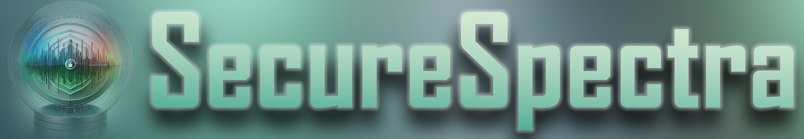
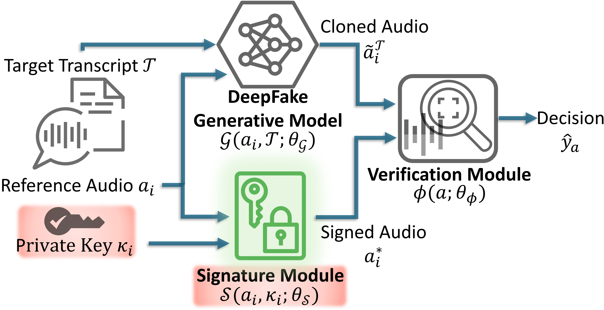
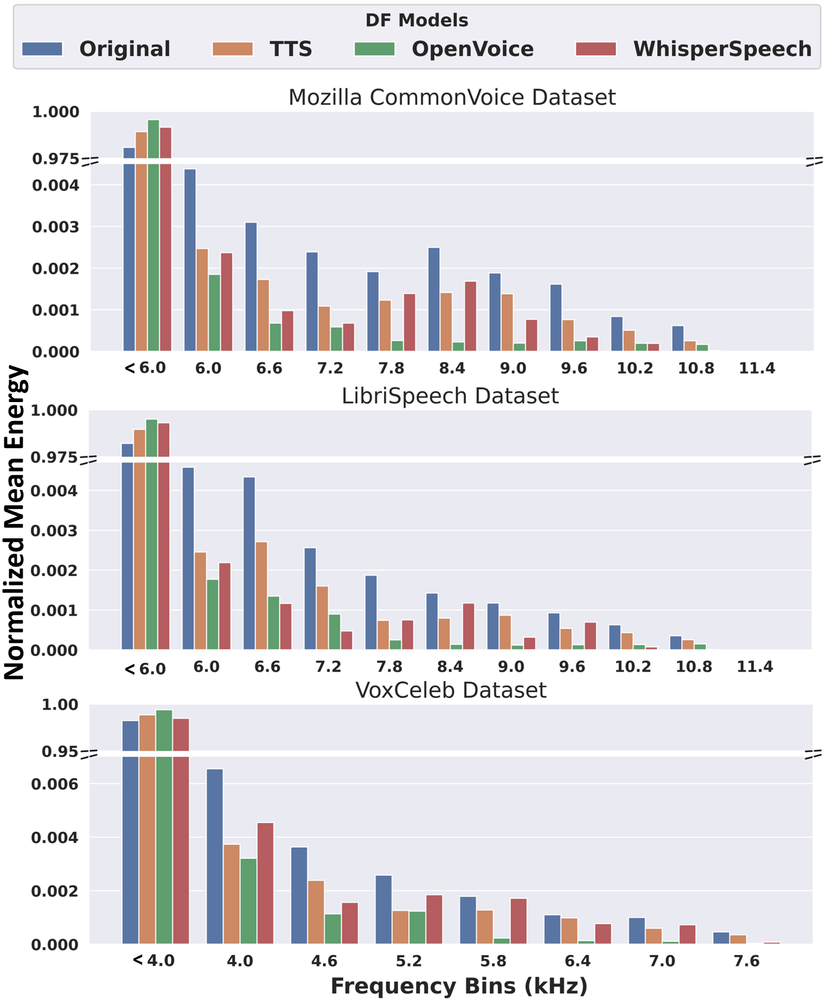
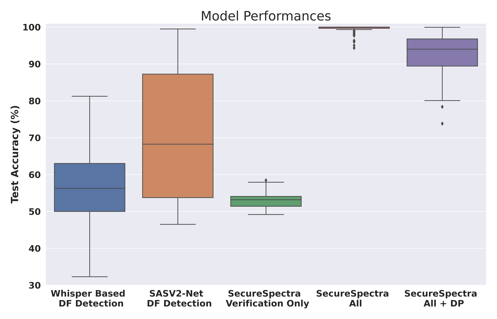

# Safeguarding Digital Identity from Deep Fake Threats via Intelligent Spectral Analysis

The advancement of DeepFake (DF) technologies poses significant threats to voice authentication systems. DF-derived phishing attacks leverage generative machine learning (ML) models to generate indistinguishable audio clones. SecureSpectra patches such attacks by embedding orthogonal and irreversible signatures within the audio spectrum. Through extensive empirical analysis of datasets, such as Mozilla Common Voice, LibriSpeech, and VoxCeleb, SecureSpectra demonstrates superior detection accuracy by outperforming SoTA ML-based countermeasures by up to 71%.

## Rising Wave of Voice Cloning and DeepFakes
In the very last years, sophisticated generative models that can replicate a person’s voice with a given transcript have been developed. Examples include Coqui.ai, WhisperSpeech, and OpenVoice platforms. With these models, unauthorized individuals can clone target voices from recordings of as brief as two seconds. This poses serious threats to personal and institutional security. We designed SecureSpectra to safeguard against voice misuse in privacy-critical applications like banking and healthcare, where voice authentication plays a pivotal role. Inspired by the urgent need to protect against these sophisticated attacks, especially those targeting influential figures and risking compliance with data protection regulations, we create SecureSpectra as a robust defense mechanism from multiple threat angles. 

## Multangular Strategy Against Digital Impersonation
SecureSpectra represents a paradigm shift in combating DeepFake threats. Unlike discriminator-like DF classifiers, it employs an orthogonal approach, a confidential signature model, that incorporates neural network processing and differential privacy. At its core, it exploits the inherent weakness of DF models in generating HF signals, a discovery that forms the foundation of SecureSpectra's signature embedding technique. By integrating differential privacy, SecureSpectra not only ensures the security of these signatures against reverse engineering but also delicately balances the trade-off between security enhancement and performance integrity. The system architecture is demonstrated in the figure below.

## DeepFake Models’ Bias Towards Low-Frequency Region
<!--  -->

We analyzed the spectra of original and cloned audio datasets as demonstrated in the figure above. We observed a pronounced deficiency in DF models' ability to replicate HF components. This insight is pivotal in differentiating between authentic and forged audio, setting SecureSpectra apart from conventional detection strategies.

## Superiority Over Existing Solutions
Existing solutions offer using ML classifiers trained to detect whether a provided audio is cloned or not. However, the performance of these models cannot perform better than the generative model’s discriminator. This is because generative models are trained to deceive their discriminators which are essentially the same as classifiers as a solution. SecureSpectra sets a new standard in DeepFake audio detection by addressing these inefficacies by utilizing orthogonal information. This enhances DF detection beyond the limitations of traditional ML approaches. Empirically, SecureSpectra significantly outperforms existing methods, with signature embedding leading to an 81% improvement over baseline accuracies and surpassing comparative studies by margins of 71% and 42%. The integration of Differential Privacy (DP) noise further secures the system with minimal impact on accuracy.

<!--  -->

##  Advancing the Frontier of Audio Security
SecureSpectra marks a significant milestone in the journey towards securing digital identities against the ever-growing menace of DeepFake technologies. By introducing an innovative signature embedding mechanism, this research opens new avenues for protecting audio content from cloning attacks. The success of SecureSpectra not only enhances current defense mechanisms but also sets the stage for future explorations in multi-task learning and verification modules for enhanced security.

## Citation
For more technical details, please see:
TBD: Submitted and Under Review
